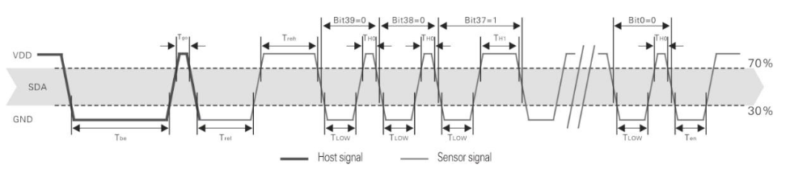

# 🌡️ DHT22 Sensor Driver for Pico In C

This repository contains a driver for the DHT22 temperature and humidity sensor for use with the Raspberry Pi Pico. The driver communicates with the DHT22 sensor over a single data line using specific timing to read the temperature and humidity values.

## 📌 Wiring Diagram



The diagram above illustrates the signal timing for single-bus communication between the host (Raspberry Pi Pico) and the DHT22 sensor.

## 🛠️ Usage

Before using this driver, ensure that the Raspberry Pi Pico SDK is installed and the `PICO_SDK_PATH` environment variable is set.

### 🏗️ Building the Project

To build the project, use the following commands:

```bash
mkdir build
cd build
cmake ..
make
```

This will compile the driver and create an executable.

## 🔧 Integration in Your Project

To integrate the DHT22 driver into your own project:

1. Copy the `DHT22-master` directory into your project.
2. In your `CMakeLists.txt`, add the directory of the DHT22 driver to `target_include_directories`.
3. Include `DHT22.h` in your `add_executable` command.

## 📊 Example Data Calculation

The DHT22 sensor sends data in 5 bytes, where:

- The first two bytes represent the humidity percentage.
- The next two bytes represent the temperature in Celsius.
- The last byte is a checksum for data integrity.

Here's an example from the datasheet:

```yaml
Received Data:
0000 0010 1001 0010 0000 0001 0000 1101 1010 0010

Calculated Checksum:
0000 0010 + 1001 0010 + 0000 0001 + 0000 1101 = 1010 0010 (Parity bit)

The received data is correct:
Humidity: 65.8% RH
Temperature: 26.9°C
```

Note: If the highest bit of the temperature data is 1, it indicates a negative temperature value.

## 📝 Special Instructions

For temperatures below 0°C, the highest bit of the temperature data will be set. For example, a temperature of -10.1°C will be represented as:

```arduino
1 000 0000 0110 0101
```

## 🤝 Contribution

Feel free to fork this project and contribute to improving the driver. If you encounter any issues or have suggestions, please open an issue in the repository.

## 📜 License

This project is licensed under the MIT License - see the LICENSE file for details.
